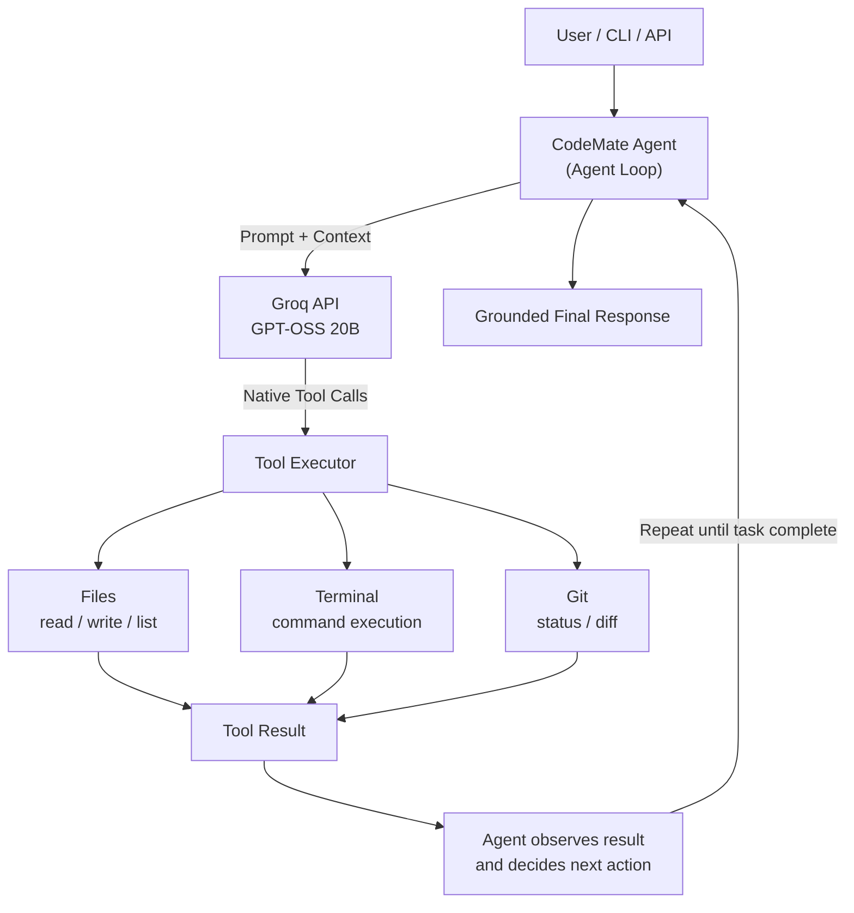

# CodeMate


> A lightweight terminal coding agent that can inspect, modify, execute, and verify code inside a controlled workspace using an LLM.

CodeMate is an AI-powered terminal coding agent built from scratch to understand and implement the core orchestration loop behind modern coding agents.

Instead of being a simple chatbot, CodeMate can decide when it needs to use tools, execute those tools, observe their results, and continue working until the requested task is completed.

CodeMate is available as both:

- a **local CLI coding agent**
- a **FastAPI HTTP API**

## Live Demo

Try it: `<YOUR_LIVE_DEMO_URL>`
API docs (Swagger UI): https://code-mate-8qh7.onrender.com/docs

> First request may take a little longer if the free-tier instance has spun down from inactivity.

## Contents

- [Demo](#demo)
- [Architecture](#architecture)
- [How the Agent Works](#how-the-agent-works)
- [CLI](#cli)
- [Available Tools](#available-tools)
- [Key Features](#key-features)
- [Tech Stack](#tech-stack)
- [Project Structure](#project-structure)
- [Running Locally](#running-locally)
- [Running the API Locally](#running-the-api-locally)
- [Docker](#docker)
- [API](#api)
- [Deployment](#deployment)
- [Security Considerations](#security-considerations)
- [Limitations](#limitations)
- [What I Learned](#what-i-learned)
- [Future Improvements](#future-improvements)
- [Status](#status)
- [License](#license)
- [Author](#author)

---

## Demo

### Example: Automatically fixing a runtime error

User:

```text
Run buggy_test.py. If it fails, inspect the error and fix the file
so it handles division by zero safely. Then run it again and tell
me the final result.
```

CodeMate:

```text
User Request → LLM → run_command → Runtime Error → read_file
→ write_file → run_command → Verified Result → Final Response
```

The important part is that CodeMate does not simply generate code and stop. It follows an execution-observation loop, where each tool result becomes context for the next agent decision.

---

## Architecture



---

## How the Agent Works

CodeMate follows a simple agent loop:

```text
1. Receive user goal
2. Send goal + context to the LLM
3. Receive the model response
4. Detect requested tool calls
5. Execute the requested tools
6. Send tool results back to the LLM
7. Repeat when another action is required
8. Generate a grounded final response
```

Conceptually:

```python
while task_not_complete:

    response = llm(messages)

    tool_calls = response.tool_calls

    if not tool_calls:
        return final_response

    for tool_call in tool_calls:
        result = execute_tool(tool_call)
        messages.append(result)
```

This loop is the core orchestration mechanism behind CodeMate.

---

## CLI

CodeMate can be used directly from the terminal.

### One-shot mode

```bash
codemate "list the files in the workspace"
```

Example output:

```text
╔══════════════════════════════════════╗
║              CodeMate                ║
║         [    By AANYA    ]           ║
╚══════════════════════════════════════╝

Task: list the files in the workspace

  Step 1  →  list_files

──────────────────────────────────────────────────
✓ TASK COMPLETED
──────────────────────────────────────────────────
```

### Interactive mode

```bash
codemate
```

Then enter tasks interactively:

```text
codemate> inspect calculator.py and fix the bug
codemate> run the tests
codemate> explain what you changed
```

Exit the session with `exit` or `quit`.

### CLI options

```bash
codemate --help
codemate --version
```

---

## Available Tools

CodeMate currently provides six tools:

| Tool          | Purpose                                         |
| ------------- | ------------------------------------------------ |
| `list_files`  | Discover files inside the workspace             |
| `read_file`   | Read a file                                     |
| `write_file`  | Create or modify a file                         |
| `run_command` | Execute an allowed command inside the workspace |
| `git_status`  | Inspect Git working-tree changes                |
| `git_diff`    | Inspect workspace differences                   |

The agent is explicitly restricted to these tools and cannot invent arbitrary tool names.

---

## Key Features

### Agentic Coding Workflow

CodeMate can perform multi-step coding tasks instead of returning a single generated response.

### Native Tool Calling

CodeMate uses Groq's structured tool calling rather than parsing free-form text. The model requests a specific tool with structured arguments, for example:

```json
{
  "name": "read_file",
  "arguments": {
    "file_path": "example.py"
  }
}
```

### Error → Inspect → Fix → Verify

CodeMate can react to actual command failures:

```text
run_command → error → read_file → write_file → run_command → verified result
```

### Test Preservation

When fixing a failing test, CodeMate is instructed to modify the underlying implementation rather than editing the test itself just to make it pass. For supported test-script structures, a programmatic guard enforces this as well, not just the prompt instruction.

### Grounded Final Responses

Final responses are generated using the actual tool execution history. This reduces the chance of the model inventing:

- file changes
- command outputs
- errors
- test results
- success claims

### Workspace Isolation

File operations are restricted to the CodeMate workspace. Absolute paths and path traversal attempts such as `../` are rejected.

### Command Restrictions

Command execution uses an allowlist of supported commands and blocks shell operators and selected destructive Git operations. This is a basic safety layer, not a production-grade sandbox.

### API Authentication

The FastAPI endpoint supports API-key authentication using the `X-API-Key` header.

### Logging

API requests and agent activity are logged for debugging and observability.

---

## Tech Stack

- Python 3.10
- Groq API
- GPT-OSS 20B (`openai/gpt-oss-20b`)
- FastAPI
- Uvicorn
- Pydantic
- Docker
- Git
- Python virtual environments

---

## Project Structure

```text
CodeMate/
│
├── agent.py
├── api.py
├── cli.py
├── executor.py
├── tools.py
├── tools_schema.py
├── prompts.py
├── config.py
├── logger.py
├── main.py
│
├── workspace/
│   └── Example coding files
│
├── Dockerfile
├── requirements.txt
├── pyproject.toml
├── .gitignore
└── README.md
```

### Core modules

**`agent.py`** — Implements the main agent loop and coordinates LLM reasoning with tool execution.

**`executor.py`** — Handles tool execution support and dispatching.

**`tools.py`** — Contains the file, terminal, and Git tools.

**`tools_schema.py`** — Defines the structured schemas used for LLM tool calling.

**`prompts.py`** — Defines system instructions that constrain the agent's behavior and available tools.

**`cli.py`** — Provides the local `codemate` command and interactive terminal interface.

**`api.py`** — Exposes CodeMate through a FastAPI HTTP API.

**`logger.py`** — Provides application logging.

**`config.py`** — Handles project configuration and environment variables.

---

## Running Locally

### 1. Clone the repository

```bash
git clone https://github.com/THEaanya09/Code-Mate
cd CodeMate
```

### 2. Create a virtual environment

```bash
python -m venv myenv
```

Activate it according to your environment.

### 3. Install dependencies

```bash
pip install -r requirements.txt
```

### 4. Install the CodeMate CLI

Install the project in editable mode:

```bash
pip install -e .
```

Verify the installation:

```bash
codemate --version
```

Expected:

```text
CodeMate 1.0.0
```

### 5. Configure Groq

Create a `.env` file:

```env
GROQ_API_KEY=your-groq-api-key
GROQ_MODEL=openai/gpt-oss-20b
CODEMATE_API_KEY=your-secret-key
```

Do not commit `.env` or expose your API keys publicly.

### 6. Run the CLI

One-shot:

```bash
codemate "list the files in the workspace"
```

Interactive:

```bash
codemate
```

---

## Running the API Locally

Start the FastAPI server:

```bash
uvicorn api:app --reload
```

The API will be available at `http://localhost:8000`, with interactive docs at `http://localhost:8000/docs`.

---

## Docker

Build the image:

```bash
docker build -t codemate .
```

Run:

```bash
docker run --rm \
  -p 8000:8000 \
  --memory=1g \
  --cpus=1.0 \
  --pids-limit=100 \
  -e GROQ_API_KEY=your-groq-api-key \
  -e GROQ_MODEL=openai/gpt-oss-20b \
  -e CODEMATE_API_KEY=your-secret-key \
  -v "$(pwd)/workspace:/app/workspace" \
  codemate
```

The image runs CodeMate as a non-root user. Resource limits and workspace mounting are configured through Docker at runtime — they are deployment configuration, not application features.

---

## API

### Health Check

```http
GET /health
```

```bash
curl http://localhost:8000/health
```

Response:

```json
{
  "status": "ok",
  "service": "CodeMate"
}
```

### Chat

```http
POST /chat
```

Headers:

```text
X-API-Key: your-secret-key
Content-Type: application/json
```

Request:

```json
{
  "message": "Run buggy_test.py and fix it if necessary."
}
```

Example:

```bash
curl -X POST http://localhost:8000/chat \
  -H "X-API-Key: your-secret-key" \
  -H "Content-Type: application/json" \
  -d '{"message":"Run buggy_test.py and fix it if necessary."}'
```

---

## Deployment

CodeMate is deployed as a FastAPI web service on Render, using:

```bash
uvicorn api:app --host 0.0.0.0 --port $PORT
```

The deployed API exposes:

```text
GET  /health
POST /chat
GET  /docs
```

### Important deployment note

The deployed service operates on its own server-side workspace. The local CLI operates on the workspace of the machine where CodeMate is installed. These are separate execution environments — changes made through the public demo do not affect your local project files, and vice versa.

---

## Security Considerations

CodeMate currently implements several basic protections:

- workspace-relative file access
- path traversal prevention
- absolute-path rejection
- command allowlisting
- blocked shell operators
- blocked destructive Git operations
- API-key authentication
- maximum message length
- non-root execution and resource limits when run via Docker

### Important

The command execution layer uses `subprocess` and is designed as a learning/portfolio project. The current safety mechanism is **not equivalent to a production-grade sandbox**. A production implementation should use stronger isolation, such as a dedicated execution sandbox or an isolated container/VM per task.

---

## Limitations

CodeMate relies on an LLM for tool selection and multi-step reasoning. Because model decisions are probabilistic, the agent can occasionally:

- choose an unnecessary tool
- make an incorrect implementation decision
- require additional verification
- fail to infer the intended behavior when the task specification is ambiguous

The project therefore includes:

- strict tool validation
- repeated-call protection
- execution-result feedback
- test-preservation checks
- grounded final responses
- maximum agent-step limits

---

## What I Learned

Building CodeMate required implementing the core pieces of an AI agent system instead of hiding the orchestration behind a high-level framework. The project demonstrates practical understanding of:

- LLM APIs
- native tool calling
- agent loops
- context/message management
- structured tool schemas
- tool execution
- error recovery
- test preservation
- API design
- CLI development
- Docker containerization
- authentication
- filesystem security
- command restrictions
- Git integration
- logging
- resource constraints

---

## Future Improvements

- streaming responses
- richer terminal UI
- better tool schemas
- stronger sandboxing
- test generation and execution
- project-aware code search
- multi-file refactoring
- model/provider abstraction
- persistent conversation sessions
- human approval for risky operations
- automated test-driven coding workflows

---

## Status

**Working prototype**

CodeMate currently supports a complete loop:

```text
User Goal → LLM → Tool Selection → Tool Execution → Observation
→ Next Action → Verification → Grounded Final Response
```

The project is intentionally built around the underlying agent orchestration loop rather than a high-level agent framework.


## Author

**Aanya Sharma**

Built as a hands-on exploration of how modern terminal coding agents work under the hood.
