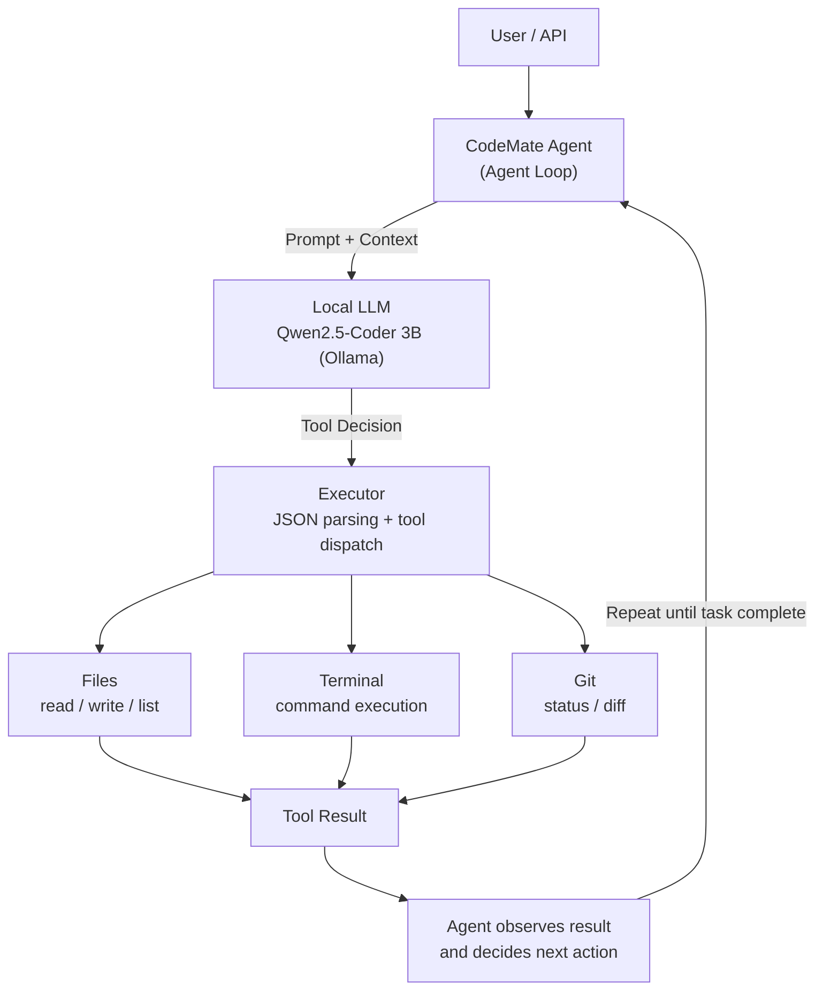

# CodeMate

> A lightweight terminal coding agent that can inspect, modify, execute, and verify code inside a controlled workspace using a local LLM.

CodeMate is an AI-powered coding agent built from scratch to understand and implement the core orchestration loop behind modern terminal coding agents.

Instead of being a simple chatbot, CodeMate can decide when it needs to use tools, execute those tools, observe their results, and continue working until the requested task is completed.

---

## Demo

### Example: Automatically fixing a runtime error

User:

```text
Run buggy_test.py. If it fails, inspect the error and fix the file
so it handles division by zero safely. Then run it again and tell
me the final result.
```

CodeMate:

```text
User Request → LLM → run_command → Runtime Error → read_file
→ write_file → run_command → Verified Result → Final Response
```

The important part is that CodeMate does not simply generate code and stop. It follows an execution-observation loop.

> **Note:** A terminal recording (GIF) or screenshot of this demo in action would go a long way here for portfolio/recruiter viewers — see "Suggested Next Steps" at the end of this file.

---

## Architecture



---

## How the Agent Works

CodeMate follows a simple agent loop:

```text
1. Receive user goal
2. Send goal + context to the LLM
3. Parse the LLM response
4. Detect a requested tool call
5. Execute the tool
6. Send the tool result back to the LLM
7. Repeat when another action is required
8. Generate a grounded final response
```

Conceptually:

```python
while task_not_complete:

    response = llm(messages)

    tool_calls = parse(response)

    if not tool_calls:
        return final_response

    for tool_call in tool_calls:
        result = execute_tool(tool_call)
        messages.append(result)
```

This is the core orchestration mechanism behind the project.

---

## Available Tools

CodeMate currently provides six tools:

| Tool          | Purpose                                |
| ------------- | --------------------------------------- |
| `list_files`  | Discover files inside the workspace    |
| `read_file`   | Read a file                            |
| `write_file`  | Create or modify a file                |
| `run_command` | Execute a command inside the workspace |
| `git_status`  | Inspect Git working-tree changes       |
| `git_diff`    | Inspect workspace differences          |

The agent is explicitly restricted to these tools and cannot invent arbitrary tool names.

---

## Key Features

### Agentic Coding Workflow

CodeMate can perform multi-step coding tasks instead of returning a single generated response.

### Tool Calling

The LLM can request tools using structured JSON:

```json
{
  "name": "read_file",
  "arguments": {
    "file_path": "example.py"
  }
}
```

### Error → Inspect → Fix → Verify

CodeMate can react to actual command failures:

```text
run_command → error → read_file → write_file → run_command → verified result
```

### Grounded Final Responses

Final responses are generated using the actual tool execution history. This reduces the chance of the model inventing:

- file changes
- command outputs
- errors
- test results
- success claims

### Workspace Isolation

File operations are restricted to the CodeMate workspace. Absolute paths and path traversal attempts such as `../` are rejected.

### Dockerized Execution

CodeMate runs inside Docker with:

- non-root user
- memory limit
- CPU limit
- process limit
- isolated workspace mount

### API Authentication

The FastAPI endpoint supports API-key authentication using the `X-API-Key` header.

### Logging

API requests and agent activity are logged for debugging and observability.

---

## Tech Stack

- Python 3.10
- Ollama
- Qwen2.5-Coder 3B
- FastAPI
- Uvicorn
- Docker
- Git
- Zsh / WSL

---

## Project Structure

```text
CodeMate/
│
├── agent.py
├── api.py
├── executor.py
├── tools.py
├── tools_schema.py
├── prompts.py
├── config.py
├── logger.py
├── main.py
│
├── workspace/
│   └── Example coding files
│
├── logs/
│   └── codemate.log
│
├── Dockerfile
├── requirements.txt
└── README.md
```

### Core modules

**`agent.py`** — Implements the main agent loop and coordinates LLM reasoning with tool execution.

**`executor.py`** — Parses model-generated tool calls and dispatches them to the appropriate tool.

**`tools.py`** — Contains the actual file, terminal, and Git tools.

**`prompts.py`** — Defines the system instructions that constrain the agent's behavior and available tools.

**`api.py`** — Exposes CodeMate through a FastAPI HTTP API.

**`logger.py`** — Provides application logging.

---

## Running Locally

### 1. Clone the repository

```bash
git clone <YOUR_GITHUB_REPOSITORY_URL>
cd CodeMate
```

### 2. Create a virtual environment

```bash
python -m venv myenv
```

Activate it according to your environment.

### 3. Install dependencies

```bash
pip install -r requirements.txt
```

### 4. Install Ollama

```bash
ollama pull qwen2.5-coder:3b
```

Make sure Ollama is running.

### 5. Configure the API key

Create a `.env` file:

```env
CODEMATE_API_KEY=your-secret-key
```

### 6. Start the API

```bash
uvicorn api:app --reload
```

The API will be available at `http://localhost:8000`.

---

## Docker

Build the image:

```bash
docker build -t codemate .
```

Run:

```bash
docker run --rm \
  -p 8000:8000 \
  --memory=1g \
  --cpus=1.0 \
  --pids-limit=100 \
  -e OLLAMA_HOST=http://host.docker.internal:11434 \
  -e CODEMATE_API_KEY=your-secret-key \
  -v "$(pwd)/workspace:/app/workspace" \
  codemate
```

---

## API

### Health Check

```http
GET /health
```

```bash
curl http://localhost:8000/health
```

### Chat

```http
POST /chat
```

Headers:

```text
X-API-Key: your-secret-key
Content-Type: application/json
```

```bash
curl -X POST http://localhost:8000/chat \
  -H 'X-API-Key: your-secret-key' \
  -H 'Content-Type: application/json' \
  -d '{"message":"Run buggy_test.py and fix it if necessary."}'
```

---

## Security Considerations

CodeMate currently implements several basic protections:

- workspace-relative file access
- path traversal prevention
- absolute-path rejection
- blocked dangerous commands
- blocked destructive Git operations
- Docker non-root execution
- container resource limits
- API-key authentication

### Important

The current command execution layer uses `subprocess` and is designed as a learning/portfolio project. The command safety mechanism is not equivalent to a production-grade sandbox. A future production implementation should use stronger isolation and a dedicated execution sandbox.

---

## Limitations

CodeMate currently uses a relatively small local coding model (Qwen2.5-Coder 3B). Because of the model size, tool selection and reasoning can occasionally be imperfect.

The project therefore includes:

- strict tool validation
- repeated-call protection
- execution-result feedback
- grounded final responses
- maximum agent-step limits

---

## What I Learned

Building CodeMate required implementing the core pieces of an AI agent system instead of hiding the orchestration behind a high-level framework. The project demonstrates practical understanding of:

- LLM APIs
- tool calling
- agent loops
- context/message management
- structured output parsing
- tool execution
- error recovery
- API design
- Docker containerization
- authentication
- filesystem security
- Git integration
- logging
- resource constraints

---

## Future Improvements

- streaming responses
- richer terminal UI
- better tool schemas
- stronger sandboxing
- test generation and execution
- project-aware code search
- multi-file refactoring
- model/provider abstraction
- persistent conversation sessions
- human approval for risky operations
- automated test-driven coding workflows

---

## Status

**Working prototype**

CodeMate currently supports a complete `User Goal → LLM → Tool Selection → Tool Execution → Observation → Next Action → Verification → Grounded Final Response` loop.

---

## Author

**Aanya Sharma**

Built as a hands-on exploration of how modern terminal coding agents work under the hood.
