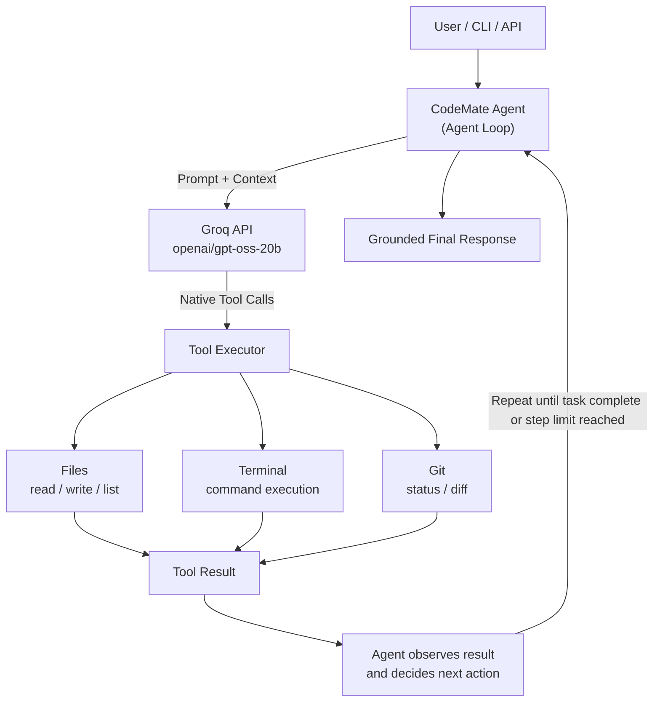

# CodeMate

> A lightweight terminal coding agent that can inspect, modify, execute, and verify code inside a workspace using an LLM.

**Version:** 1.0.2 &nbsp;·&nbsp; **Status:** early-stage, actively evolving

**Live API:** https://code-mate-hmlw.onrender.com &nbsp;·&nbsp; **Docs:** https://code-mate-hmlw.onrender.com/docs
*(the free-tier instance may take a little longer to respond after periods of inactivity)*

## Contents

- [Overview](#overview)
- [Tech Stack](#tech-stack)
- [Features](#features)
- [Architecture](#architecture)
- [Available Tools](#available-tools)
- [Installation](#installation)
- [First Run](#first-run)
- [Usage](#usage)
- [API](#api)
- [Docker](#docker)
- [Development](#development)
- [Project Structure](#project-structure)
- [Security](#security)
- [Limitations](#limitations)
- [Roadmap](#roadmap)
- [Contributing](#contributing)
- [License](#license)
- [Author](#author)

---

## Overview

CodeMate is an AI-powered terminal coding agent built to understand and implement the core orchestration loop behind modern coding agents, rather than relying on a high-level agent framework.

Instead of behaving like a simple chatbot, CodeMate decides when it needs to use a tool, executes it, observes the result, and continues working until the task is complete or a maximum step limit is reached.

CodeMate is available in two forms:

- a **CLI coding agent**, installable from PyPI
- a **FastAPI HTTP API**, currently deployed on Render

This is an early-stage, actively evolving project. See [Limitations](#limitations) and [Roadmap](#roadmap) below.

---

## Tech Stack

- Python
- Groq API
- `openai/gpt-oss-20b`
- FastAPI
- Pydantic
- python-dotenv
- Docker
- Git
- PyPI packaging

---

## Features

- **Agentic coding workflow** — multi-step tasks are handled through an iterative loop rather than a single generated response.
- **Native tool calling** — tool requests are made through Groq's structured tool-calling interface, not by parsing free-form text.
- **Error → Inspect → Fix → Verify** — the agent can react to real command failures: run a command, inspect the resulting error, read the relevant file, write a fix, and re-run to verify.
- **Test preservation** — when fixing a failing test, the agent is instructed to fix the implementation rather than editing the test to force a pass. A programmatic guard reinforces this for supported test-script structures.
- **Grounded final responses** — final responses are generated from the actual tool execution history, which reduces the chance of the model inventing file changes, outputs, or results that didn't happen.
- **Workspace isolation** — file operations are restricted to the configured workspace; absolute paths and path-traversal attempts (e.g. `../`) are rejected.
- **Command restrictions** — command execution is limited to an allowlist and blocks shell operators and selected destructive Git operations.
- **API-key authentication** — the FastAPI service requires an `X-API-Key` header.
- **Logging** — API requests and agent activity are logged for debugging and observability.

---

## Architecture



The loop, conceptually:

```text
1. Receive user goal
2. Send goal + context to the LLM
3. Receive the model response
4. Detect requested tool calls
5. Execute the requested tools
6. Send tool results back to the LLM
7. Repeat when another action is required
8. Generate a grounded final response
```

```python
while task_not_complete:
    response = llm(messages)
    tool_calls = response.tool_calls

    if not tool_calls:
        return final_response

    for tool_call in tool_calls:
        result = execute_tool(tool_call)
        messages.append(result)
```

A tool call is returned in structured form, for example:

```json
{
  "name": "read_file",
  "arguments": {
    "file_path": "example.py"
  }
}
```

---

## Available Tools

| Tool          | Purpose                                         |
| ------------- | ------------------------------------------------ |
| `list_files`  | Discover files inside the workspace             |
| `read_file`   | Read a file                                     |
| `write_file`  | Create or modify a file                         |
| `run_command` | Execute an allowed command inside the workspace |
| `git_status`  | Inspect Git working-tree changes                |
| `git_diff`    | Inspect workspace differences                   |

The agent is explicitly restricted to these tools and cannot invent arbitrary tool names.

---

## Installation

Install from PyPI:

```bash
pip install codemate-ai
```

Note the package name (`codemate-ai`) is different from the CLI command it installs (`codemate`).

Then run:

```bash
codemate
```

The first time you run it, CodeMate will walk you through a one-time API key setup — see [First Run](#first-run) below.

*(This package was validated through TestPyPI prior to its PyPI release.)*

---

## First Run

CodeMate uses [Groq](https://console.groq.com) to run `openai/gpt-oss-20b`. You'll need your own Groq API key — it's free to create one at [console.groq.com](https://console.groq.com). Don't use anyone else's key.

If no key is configured yet, the CLI will prompt you:

```text
Groq API key is not configured.

You only need to do this once.
Your key will be saved in:
~/.codemate/.env

Enter your Groq API key:
```

The key is entered through a hidden, password-style prompt — it is not echoed to the terminal or printed anywhere. It's saved locally at `~/.codemate/.env`, outside the project directory, and future runs load it automatically.

Never commit `~/.codemate/.env`, or any `.env` file, to version control.

---

## Usage

### Interactive mode

```bash
codemate
```

```text
codemate> list the files in the workspace
codemate> create a Python calculator in the workspace
codemate> find and fix the bug in buggy_test.py
```

Exit the session with `exit` or `quit`.

### One-shot mode

```bash
codemate "fix the bug in buggy_test.py"
```

Example output:

```text
╔══════════════════════════════════════╗
║              CodeMate                ║
║         [    By AANYA    ]           ║
╚══════════════════════════════════════╝

Task: list the files in the workspace

  Step 1  →  list_files

──────────────────────────────────────────────────
✓ TASK COMPLETED
──────────────────────────────────────────────────
```

### CLI options

```bash
codemate --help
codemate --version
```

---

## API

CodeMate also exposes a FastAPI-based HTTP API, separate from the CLI.

**Live deployment:** https://code-mate-hmlw.onrender.com
**Interactive docs:** https://code-mate-hmlw.onrender.com/docs

| Endpoint | Method | Description |
|---|---|---|
| `/health` | GET | Health check |
| `/chat` | POST | Send a task to the agent |

Requests require an `X-API-Key` header. Request bodies are validated, and messages have a maximum length.

### Health check

```bash
curl https://code-mate-hmlw.onrender.com/health
```

```json
{
  "status": "ok",
  "service": "CodeMate"
}
```

### Chat

```bash
curl -X POST https://code-mate-hmlw.onrender.com/chat \
  -H "X-API-Key: <your-api-key>" \
  -H "Content-Type: application/json" \
  -d '{"message":"list the files in the workspace"}'
```

During local development, replace the base URL with `http://localhost:8000` after starting the server:

```bash
uvicorn api:app --reload
```

**Important:** the API runs in its own server-side workspace, separate from your machine. It cannot read or modify files on your local computer, and the CLI cannot see or affect what happens on the deployed API — they are independent execution environments.

---

## Docker

The Dockerfile packages the FastAPI service (not the CLI) using the Groq-based backend.

Build:

```bash
docker build -t codemate .
```

Run:

```bash
docker run --rm \
  -p 8000:8000 \
  --memory=1g \
  --cpus=1.0 \
  --pids-limit=100 \
  -e GROQ_API_KEY=your-groq-api-key \
  -e GROQ_MODEL=openai/gpt-oss-20b \
  -e CODEMATE_API_KEY=your-secret-key \
  -v "$(pwd)/workspace:/app/workspace" \
  codemate
```

The container runs as a non-root user. Resource limits and the workspace mount are configured through Docker at runtime — they're deployment configuration, not application features. Never bake real key values into the image or commit them to version control.

---

## Development

For contributors who want to work on CodeMate directly (rather than installing the published package):

```bash
git clone https://github.com/THEaanya09/Code-Mate.git
cd Code-Mate
```

Create a virtual environment:

```bash
python -m venv venv
```

Activate it:

```bash
# Windows
venv\Scripts\activate

# macOS / Linux
source venv/bin/activate
```

Install dependencies:

```bash
pip install -r requirements.txt
```

To test CLI changes locally, install the project in editable mode:

```bash
pip install -e .
codemate --version
```

Expected:

```text
CodeMate 1.0.2
```

To run the API locally:

```bash
uvicorn api:app --reload
```

Available at `http://localhost:8000`, with interactive docs at `http://localhost:8000/docs`.

---

## Project Structure

```text
Code-Mate/
├── main.py
├── agent.py
├── cli.py
├── api.py
├── executor.py
├── tools.py
├── tools_schema.py
├── prompts.py
├── config.py
├── logger.py
├── workspace/
├── requirements.txt
├── pyproject.toml
├── Dockerfile
└── README.md
```

**`main.py`** — Project entry point.

**`agent.py`** — Implements the main agent loop and coordinates LLM reasoning with tool execution.

**`cli.py`** — Provides the local `codemate` command and interactive terminal interface, including first-run API key setup.

**`api.py`** — Exposes CodeMate through a FastAPI HTTP API.

**`executor.py`** — Dispatches requested tool calls to the corresponding tool implementation.

**`tools.py`** — Contains the file, terminal, and Git tools.

**`tools_schema.py`** — Defines the structured schemas used for LLM tool calling.

**`prompts.py`** — Defines the system instructions that constrain the agent's behavior and available tools.

**`config.py`** — Handles project configuration and environment variables.

**`logger.py`** — Provides application logging.

---

## Security

- Never commit API keys or `.env` files.
- The Groq API key is stored locally at `~/.codemate/.env` by the CLI's first-run setup, outside the project directory.
- The agent is restricted to a fixed set of tools and cannot invent new ones.
- Command execution goes through an allowlist and blocks shell operators and selected destructive Git operations. This is a basic safety layer, **not a production-grade sandbox** — don't treat it as a fully secure execution environment.
- Review any code the agent generates or modifies before using it in a sensitive environment.
- The deployed API and your local machine are separate environments; the API cannot read or modify your local files.

---

## Limitations

- Early-stage, actively evolving project — not production-ready or enterprise-grade.
- LLM tool selection and reasoning are probabilistic and can occasionally be imperfect: an unnecessary tool call, an incorrect implementation choice, or difficulty inferring intent from an ambiguous task.
- Tool execution is intentionally constrained, which limits what the agent can do in a single run.
- The local CLI only operates within its configured local workspace.
- The remote API operates in its own separate server-side environment.

---

## Roadmap

- Better agent planning
- More robust verification
- Additional tools
- Improved error recovery
- Richer terminal UI
- Streaming responses
- Better packaging / release automation
- Improved test coverage
- Better documentation

---

## Contributing

CodeMate is primarily a personal learning and portfolio project, but issues, suggestions, and pull requests are welcome. If you'd like to contribute, please open an issue first to discuss the change, then submit a pull request.

---

## License

This project is licensed under the [MIT License](LICENSE).

---

## Author

**Aanya Sharma**

Built as a hands-on exploration of how modern terminal coding agents work under the hood.
